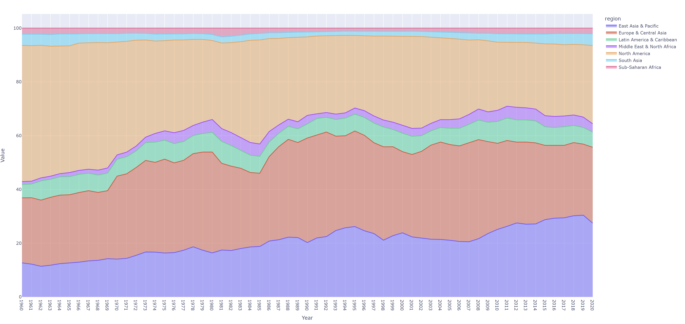

# WorldBankAnalysis
Applying Python to query the World Bank API

Publicly available data is available from the World Bank. One dataset which contains
information about countries is available through World Bank API and its documentation 1
provides all the necessary details on how to use it. Another dataset which includes Gross
Domestic Product (GDP) data in CSV format is available for download from World Bank 2
Data Catalog.

We recommend you keep notes of your design, problems you have encountered as well as
steps you have taken to resolve them. We might ask you to present your solution.
## Objectives

1. Write Python script to retrieve countries’ data from a World Bank Country API as
well GDP data from World Bank Data Catalog.
2. Store all data in a database; ideally PostgreSQL locally.
○ Model data in a way to be able to perform data analysis (see below).
3. Write SQL queries to answer questions below.

## Analysis
1. List countries with income level of "Upper middle income".
2. List countries with income level of "Low income" per region.
3. Find the region with the highest proportion of "High income" countries.
4. Calculate cumulative/running value of GDP per region ordered by income from
lowest to highest and country name.
5. Calculate percentage difference in value of GDP year-on-year per country.
6. List 3 countries with lowest GDP per region.
7. Provide an interesting fact from the dataset.

## Design decisions:
1. Two APIs version of the country API are avaible - batch and individual. Given the low volume of information (only <300 countries), the batch version was preferred over a loop + individual calls.
2. Transfer of in-memory (Pandas DF) data to Server is done via the to_sql DF method, which is more readable. This method is very slow when dealing with a large volume of data but would suffice for <1k records. 
3. The code is executed via "python master.py", which prints out the responses to the command line.
4. Business logic (SQL) and code execution are separated out in separate SQL files for ease of change.
5. Question 5 asks for the change in GDP without specifying a base year. This produces > 10k output rows, making it a very data-intensive operation. The current version limits the output only to the last observed year for readability, but this filter can be easily removed.

## Answer
Answers to questions can be found [here](./answers_to_questions.txt) 

## Interesting fact
Since the early 2000s, economic commentators have predicted the decline of the "Western" economies (Europe + America) in favour of emerging economies (such as the BRICS). The last 2 years, and especially COVID, have reversed this trend - as can be seen the % of the global economy of America has gone up. This is likely because the US is largely a service economy which is easier to be executed remotely, and less likely to have been disrupted by COVID.

